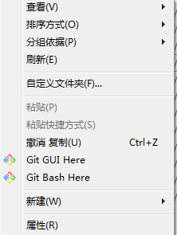
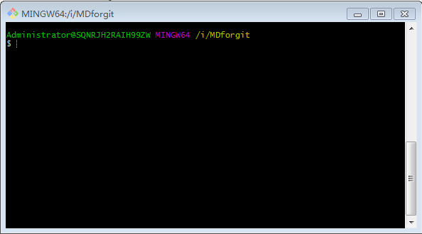
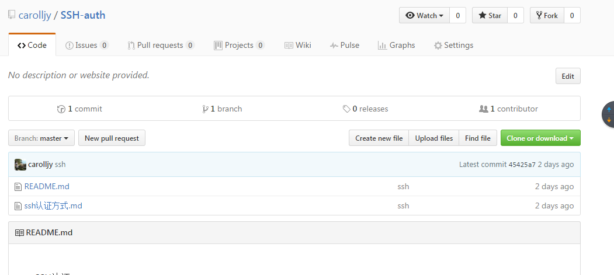
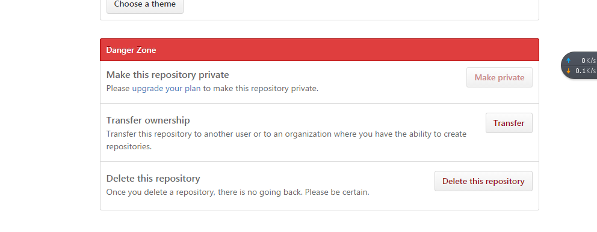
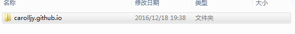
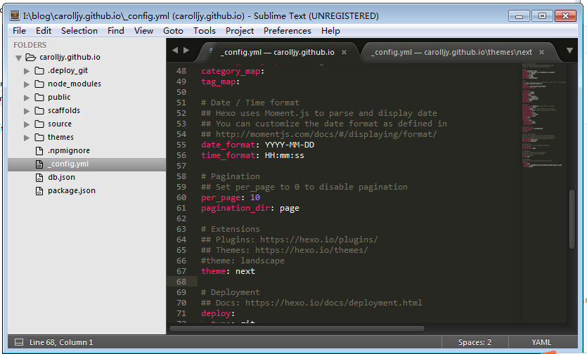
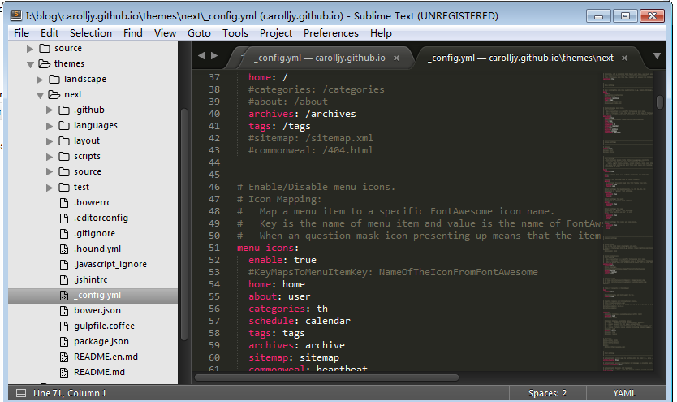

# github的使用#

[TOC]

## 1.什么是github##

通常情况下，我们作为代码的管理人员，会遇到这么一些问题：代码分散的拷贝在各个分区之中，不知道哪个代码文件是最新的，也不清楚哪个代码文件是最优的。错误的复制、替换经常会导致原来尚能运行的代码遭到破坏。于是，针对以上的问题就产生了一种解决方案，这种方案我们称为版本控制。版本控制系统是能够随着时间的推进记录一系列文件的变化以便于你以后想要的退回到某个版本的系统。

而在版本控制系统中，最为出名的版本控制软件名为git，由于其分布式的特征而被大多数用户所青睐。

GitHub 是一个面向开源及私有软件项目的托管平台，因为只支持 Git 作为唯一的版本库格式进行托管，故名 GitHub。

github的网站地址：https://github.com/

## 2.github网站的使用##

#### 1.注册####

自行注册，过程略。

#### 2.配置git工具####

windows环境：安装git-bash软件

下载网址：https://git-scm.com/download/win

linux环境：安装git软件

```config
yum -y install git
```
#### 3.配置一个全新的版本库

1）创建新的版本库：

登录github网站，点击create a new repository，看到如图所示：自拟版本库的名称：


2）在本地新建一个目录，将需要上传至github的文档放入该目录，初始化本地版本库。

进入该目录，右键如图所示，选择git bash here：



会看到如下图示；



执行操作如下：

```shell
1）git init # 初始化版本库
2）编写README.md文件 # 该文件里内容为对于此版本库的说明文件
3）git add ./ # 将目录下所有文件添加进git的暂存区
4）git commit -m "提交说明" # 将文件正式提交至版本库，并加以说明
5）git remote add origin https://github.com/carolljy/abc.git  # 配置远程连接的方式，可以采用https，也可以采用ssh。
6）git push -u origin master # 将文件传输至github
```

#### 4.删除github的版本库####



点击Settings，按住下拉菜单到最后，选择Delete this repository。



#### 5.下载版本库到本地####

先选择github上关注的项目，找到其仓库所在的url地址。


自行选择目录，运行git bash here工具，执行以下指令即可

```shell
$ git clone https://github.com/carolljy/UP200_git.git
```

#### 6.上传修改后文件至github####

在对应工作目录下，使用git bash here工具，执行以下操作

```shell
$ git add ./    # 添加文件
$ git commit -m "该文件已修改"  # 提交修改信息
$ git push  # 推送至github即可。 
```

## 3.github的博客搭建##

#### 1)  node.js的安装####

下载地址：https://nodejs.org/en/，此软件提供搭建博客所需要的基础环境，自行运行exe文件，安装即可。

#### 2)  sublime的安装####

下载地址：http://www.sublimetext.com/，此软件为内容编辑器

#### 3)  alias别名的配置####

访问http://npm.taobao.org/网站，查看具体教程。

使用git bash here工具，执行以下指令

```shell
$ vim ~/.bashrc
alias cnpm="npm --registry=https://registry.npm.taobao.org \
--cache=$HOME/.npm/.cache/cnpm \
--disturl=https://npm.taobao.org/dist \
--userconfig=$HOME/.cnpmrc"
$ source ~/.bashrc
```

#### 4)  hexo的安装####

```shell
$ cnpm install -g hexo-cli
```

#### 5)  hexo的初始化####

先创建一个文件夹，这里创建的文件夹名为carolljy.github.io。

如图：



进入该目录，使用git bash here工具，执行以下命令

```shell
$ hexo init
```

#### 6)  下载next主题####

next主题官网：http://theme-next.iissnan.com/

在carolljy.github.io目录下使用git bash here工具，执行一下命令

```shell
git clone https://github.com/iissnan/hexo-theme-next themes/next
```

#### 7)  hexo的配置####

修改站点配置文件

修改参数如下

```shell
# Site
title: Carolljy's Blog   #  blog的名称
subtitle: In solitude, be a multitude to yourself   #　子标题
description: redhat　　# 描述信息
author: Li Jiayi  # 作者
language: zh-Hans  # 语言：这里设置成汉语
timezone: Asia/Shanghai  # 时区

# URL
## If your site is put in a subdirectory, set url as 'http://yoursite.com/child' and root as '/child/'
url: http://carolljy.github.io  # 指向你的io
root: /
permalink: :year/:month/:day/:title/
permalink_defaults:

# Directory
source_dir: source
public_dir: public
tag_dir: tags
archive_dir: archives
category_dir: categories
code_dir: downloads/code
i18n_dir: :lang
skip_render:

# Writing
new_post_name: :title.md # File name of new posts
default_layout: post
titlecase: false # Transform title into titlecase
external_link: true # Open external links in new tab
filename_case: 0
render_drafts: false
post_asset_folder: false
relative_link: false
future: true
highlight:
  enable: true
  line_number: true
  auto_detect: false
  tab_replace:

# Category & Tag
default_category: uncategorized
category_map:
tag_map:

# Date / Time format
## Hexo uses Moment.js to parse and display date
## You can customize the date format as defined in
## http://momentjs.com/docs/#/displaying/format/
date_format: YYYY-MM-DD
time_format: HH:mm:ss

# Pagination
## Set per_page to 0 to disable pagination
per_page: 10
pagination_dir: page

# Extensions
## Plugins: https://hexo.io/plugins/
## Themes: https://hexo.io/themes/
#theme: landscape
theme: next  #  使用next主题

# Deployment
## Docs: https://hexo.io/docs/deployment.html
deploy:
  type: git  # 使用git类型
  repository: git@github.com:carolljy/carolljy.github.io.git  # git的仓库版本
  branch: master  # git分支

```

修改主题配置文件：



修改参数如下：

```shell
# ---------------------------------------------------------------
# Site Information Settings
# ---------------------------------------------------------------

# Put your favicon.ico into `hexo-site/source/` directory.
favicon: /favicon.ico

# Set default keywords (Use a comma to separate)
keywords: "keep walking"

# Set rss to false to disable feed link.
# Leave rss as empty to use site's feed link.
# Set rss to specific value if you have burned your feed already.
rss:

# Specify the date when the site was setup
#since: 2015

# icon between year and author @Footer
authoricon: Li JiaYi

# Footer `powered-by` and `theme-info` copyright
copyright: true

# Canonical, set a canonical link tag in your hexo, you could use it for your SEO of blog.
# See: https://support.google.com/webmasters/answer/139066
# Tips: Before you open this tag, remeber set up your URL in hexo _config.yml ( ex. url: http://yourdomain.com )
canonical: true


# ---------------------------------------------------------------
# Menu Settings
# ---------------------------------------------------------------

# When running the site in a subdirectory (e.g. domain.tld/blog), remove the leading slash (/archives -> archives)
menu:
  home: /
  #categories: /categories
  #about: /about
  archives: /archives
  tags: /tags
  #sitemap: /sitemap.xml
  #commonweal: /404.html


# Enable/Disable menu icons.
# Icon Mapping:
#   Map a menu item to a specific FontAwesome icon name.
#   Key is the name of menu item and value is the name of FontAwsome icon. Key is case-senstive.
#   When an question mask icon presenting up means that the item has no mapping icon.
menu_icons:
  enable: true
  #KeyMapsToMenuItemKey: NameOfTheIconFromFontAwesome
  home: home
  about: user
  categories: th
  schedule: calendar
  tags: tags
  archives: archive
  sitemap: sitemap
  commonweal: heartbeat


# ---------------------------------------------------------------
# Scheme Settings
# ---------------------------------------------------------------

# Schemes
scheme: Muse   # 选择一种风格
#scheme: Mist
#scheme: Pisces


# ---------------------------------------------------------------
# Font Settings
# - Find fonts on Google Fonts (https://www.google.com/fonts)
# - All fonts set here will have the following styles:
#     light, light italic, normal, normal intalic, bold, bold italic
# - Be aware that setting too much fonts will cause site running slowly
# - Introduce in 5.0.1
# ---------------------------------------------------------------
font:
  enable: true

  # Uri of fonts host. E.g. //fonts.googleapis.com (Default)
  host:

  # Global font settings used on <body> element.
  global:
    # external: true will load this font family from host.
    external: true
    family: Lato

  # Font settings for Headlines (h1, h2, h3, h4, h5, h6)
  # Fallback to `global` font settings.
  headings:
    external: true
    family:

  # Font settings for posts
  # Fallback to `global` font settings.
  posts:
    external: true
    family:

  # Font settings for Logo
  # Fallback to `global` font settings.
  # The `size` option use `px` as unit
  logo:
    external: true
    family:
    size:

  # Font settings for <code> and code blocks.
  codes:
    external: true
    family:
    size:


# ---------------------------------------------------------------
# Sidebar Settings
# ---------------------------------------------------------------


# Social Links
# Key is the link label showing to end users.
# Value is the target link (E.g. GitHub: https://github.com/iissnan)
#social:
  #LinkLabel: Link


# Social Links Icons
# Icon Mapping:
#   Map a menu item to a specific FontAwesome icon name.
#   Key is the name of the item and value is the name of FontAwsome icon. Key is case-senstive.
#   When an globe mask icon presenting up means that the item has no mapping icon.
social_icons:
  enable: true
  # Icon Mappings.
  # KeyMapsToSocalItemKey: NameOfTheIconFromFontAwesome
  GitHub: github
  Twitter: twitter
  Weibo: weibo


# Sidebar Avatar
# in theme directory(source/images): /images/avatar.jpg
# in site  directory(source/uploads): /uploads/avatar.jpg
#avatar:


# Table Of Contents in the Sidebar
toc:
  enable: true

  # Automatically add list number to toc.
  number: true


# Creative Commons 4.0 International License.
# http://creativecommons.org/
# Available: by | by-nc | by-nc-nd | by-nc-sa | by-nd | by-sa | zero
#creative_commons: by-nc-sa
#creative_commons:


sidebar:
  # Sidebar Position, available value: left | right
  position: left
  #position: right

  # Sidebar Display, available value:
  #  - post    expand on posts automatically. Default.
  #  - always  expand for all pages automatically
  #  - hide    expand only when click on the sidebar toggle icon.
  #  - remove  Totally remove sidebar including sidebar toggler.
  #display: post
  #display: always
  display: hide
  #display: remove


# Blogrolls
#links_title: Links
#links_layout: block
#links_layout: inline
#links:
  #Title: http://example.com/


# ---------------------------------------------------------------
# Post Settings
# ---------------------------------------------------------------

# Automatically scroll page to section which is under <!-- more --> mark.
scroll_to_more: true

# Automatically excerpt description in homepage as preamble text.
excerpt_description: true

# Automatically Excerpt. Not recommand.
# Please use <!-- more --> in the post to control excerpt accurately.
auto_excerpt:
  enable: false
  length: 150

# Post meta display settings
post_meta:
  created_at: true
  updated_at: false
  categories: true


# Wechat Subscriber
#wechat_subscriber:
  #enabled: true
  #qcode: /path/to/your/wechatqcode ex. /uploads/wechat-qcode.jpg
  #description: ex. subscribe to my blog by scanning my public wechat account


# ---------------------------------------------------------------
# Misc Theme Settings
# ---------------------------------------------------------------

# Custom Logo.
# !!Only available for Default Scheme currently.
# Options:
#   enabled: [true/false] - Replace with specific image
#   image: url-of-image   - Images's url
custom_logo:
  enabled: false
  image:


# Code Highlight theme
# Available value:
#    normal | night | night eighties | night blue | night bright
# https://github.com/chriskempson/tomorrow-theme
highlight_theme: normal


# ---------------------------------------------------------------
# Third Party Services Settings
# ---------------------------------------------------------------

# MathJax Support
mathjax:
  enable: false
  per_page: false
  cdn: //cdn.mathjax.org/mathjax/latest/MathJax.js?config=TeX-AMS-MML_HTMLorMML


# Swiftype Search API Key
#swiftype_key:

# Baidu Analytics ID
#baidu_analytics:

# Duoshuo ShortName
#duoshuo_shortname:

# Disqus
#disqus_shortname:

# Hypercomments
#hypercomments_id:

# Baidu Share
# Available value:
#    button | slide
# Warning: Baidu Share does not support https.
#baidushare:
##  type: button

# Share
#jiathis:
# Warning: JiaThis does not support https.
#add_this_id:

# Share
#duoshuo_share: true

# Google Webmaster tools verification setting
# See: https://www.google.com/webmasters/
#google_site_verification:


# Google Analytics
#google_analytics:

# CNZZ count
#cnzz_siteid:

# Application Insights
# See https://azure.microsoft.com/en-us/services/application-insights/
# application_insights:

# Make duoshuo show UA
# user_id must NOT be null when admin_enable is true!
# you can visit http://dev.duoshuo.com get duoshuo user id.
duoshuo_info:
  ua_enable: true
  admin_enable: false
  user_id: 0
  #admin_nickname: Author


# Facebook SDK Support.
# https://github.com/iissnan/hexo-theme-next/pull/410
facebook_sdk:
  enable: false
  app_id:       #<app_id>
  fb_admin:     #<user_id>
  like_button:  #true
  webmaster:    #true

# Facebook comments plugin
# This plugin depends on Facebook SDK.
# If facebook_sdk.enable is false, Facebook comments plugin is unavailable.
facebook_comments_plugin:
  enable: false
  num_of_posts: 10  # min posts num is 1
  width: 100%       # default width is 550px
  scheme: light     # default scheme is light (light or dark)


# Show number of visitors to each article.
# You can visit https://leancloud.cn get AppID and AppKey.
leancloud_visitors:
  enable: false
  app_id: #<app_id>
  app_key: #<app_key>

# Show PV/UV of the website/page with busuanzi.
# Get more information on http://ibruce.info/2015/04/04/busuanzi/
busuanzi_count:
  # count values only if the other configs are false
  enable: false
  # custom uv span for the whole site
  site_uv: true
  site_uv_header: <i class="fa fa-user"></i>
  site_uv_footer:
  # custom pv span for the whole site
  site_pv: true
  site_pv_header: <i class="fa fa-eye"></i>
  site_pv_footer:
  # custom pv span for one page only
  page_pv: true
  page_pv_header: <i class="fa fa-file-o"></i>
  page_pv_footer:


# Tencent analytics ID
# tencent_analytics:


# Enable baidu push so that the blog will push the url to baidu automatically which is very helpful for SEO
baidu_push: false

# Google Calendar
# Share your recent schedule to others via calendar page
#
# API Documentation:
# https://developers.google.com/google-apps/calendar/v3/reference/events/list
calendar:
  enable: false
  calendar_id: <required>
  api_key: <required>
  orderBy: startTime
  offsetMax: 24
  offsetMin: 4
  timeZone:
  showDeleted: false
  singleEvents: true
  maxResults: 250

# Algolia Search
algolia_search:
  enable: false
  hits:
    per_page: 10
  labels:
    input_placeholder: Search for Posts
    hits_empty: "We didn't find any results for the search: ${query}"
    hits_stats: "${hits} results found in ${time} ms"


#! ---------------------------------------------------------------
#! DO NOT EDIT THE FOLLOWING SETTINGS
#! UNLESS YOU KNOW WHAT YOU ARE DOING
#! ---------------------------------------------------------------

# Motion
use_motion: true

# Fancybox
fancybox: true


# Script Vendors.
# Set a CDN address for the vendor you want to customize.
# For example
#    jquery: https://ajax.googleapis.com/ajax/libs/jquery/2.2.0/jquery.min.js
# Be aware that you should use the same version as internal ones to avoid potential problems.
# Please use the https protocol of CDN files when you enable https on your site.
vendors:
  # Internal path prefix. Please do not edit it.
  _internal: lib

  # Internal version: 2.1.3
  jquery:

  # Internal version: 2.1.5
  # See: http://fancyapps.com/fancybox/
  fancybox:
  fancybox_css:

  # Internal version: 1.0.6
  # See: https://github.com/ftlabs/fastclick
  fastclick:

  # Internal version: 1.9.7
  # See: https://github.com/tuupola/jquery_lazyload
  lazyload:

  # Internal version: 1.2.1
  # See: http://VelocityJS.org
  velocity:

  # Internal version: 1.2.1
  # See: http://VelocityJS.org
  velocity_ui:

  # Internal version: 0.7.9
  # See: https://faisalman.github.io/ua-parser-js/
  ua_parser:

  # Internal version: 4.6.2
  # See: http://fontawesome.io/
  fontawesome:

  # Internal version: 1
  # https://www.algolia.com
  algolia_instant_js:
  algolia_instant_css:


# Assets
css: css
js: js
images: images

# Theme version
version: 5.1.0

```

#### 8)  hexo的本地测试

```shell
hexo server
```

然后通过本地访问localhost:4000即可

#### 9) hexo的上传操作####

使用git bash here，依次执行以下3条指令

```shell
hexo clean
hexo g
hexo d
```

